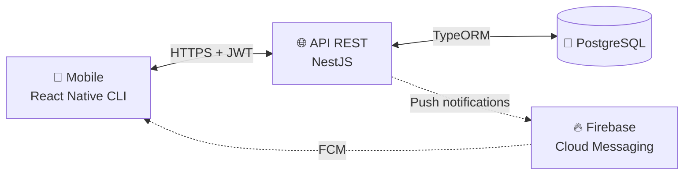

<div align="center">

# 🍼 BebeCare

**App de saúde para bebês — vacinas PNI, consultas, remédios e diário de marcos.**

Projeto pessoal e portfólio, construído enquanto acompanho o desenvolvimento do meu filho.

[](https://github.com/mguibtech/bebecare/actions/workflows/api-ci.yml)
[](https://nodejs.org/)
[](https://www.typescriptlang.org/)
[](https://nestjs.com/)
[](https://reactnative.dev/)
[](./LICENSE)

</div>

---

## 💡 Sobre o projeto

Quando meu filho nasceu, percebi que organizar **vacinas, consultas, doses de remédio e marcos do desenvolvimento** em apps genéricos era frustrante: agendas viravam bagunça, lembretes se perdiam, e eu e minha esposa repetíamos as mesmas perguntas no WhatsApp.

O **BebeCare** nasceu desse incômodo real. Ele cobre o que pais brasileiros realmente precisam — incluindo o **calendário oficial de vacinação do PNI** — e é compartilhado entre o casal em tempo real.

Além de uso pessoal diário, o projeto serve como **portfólio técnico** demonstrando React Native CLI, NestJS, PostgreSQL, Firebase Cloud Messaging, WebSocket e Docker em um cenário realista de produto.

## 📱 Funcionalidades

**V1 — primeira versão publicável na Play Store** ([roadmap completo](./docs/V1_ROADMAP.md)):

| # | Funcionalidade                                                                     | Status         |
| - | ---------------------------------------------------------------------------------- | -------------- |
| 1 | Setup do monorepo + infraestrutura Docker                                          | ✅ Concluído    |
| 2 | Autenticação JWT + convite de casal                                                | 🚧 Em andamento |
| 3 | Avatar customizável via **DiceBear** (8 estilos + seed regenerável)                | 📅 Planejado    |
| 4 | Cadastro do perfil do bebê                                                         | 📅 Planejado    |
| 5 | Calendário de vacinas seguindo o **PNI** brasileiro                                | 📅 Planejado    |
| 6 | Agenda de consultas pediátricas                                                    | 📅 Planejado    |
| 7 | Remédios com **despertador eficaz** (alarme local, toca com app fechado)           | 📅 Planejado    |
| 8 | **Despertador da mamada** (mamada, troca, soneca) com sons internos ou do device   | 📅 Planejado    |
| 9 | **Modo Soninho** — ruído branco com 8 sons curados, timer e fade out               | 📅 Planejado    |
| 10 | Dashboard "Hoje" — vacinas, consultas, doses e próximos alarmes                   | 📅 Planejado    |

**Reservado para V2:** upload de receitas médicas, lista de compras em tempo real (WebSocket), diário de marcos, exportar histórico em PDF, versão iOS e modo escuro.

## 🛠 Stack



- **Mobile:** React Native CLI (bare), TypeScript, React Navigation, TanStack Query, Zustand, React Native Paper
- **API:** NestJS 11, TypeScript, TypeORM, PostgreSQL 16, JWT (Passport), Swagger
- **Push:** Firebase Cloud Messaging
- **Real-time:** WebSocket (Socket.IO via NestJS gateway) — para lista de compras
- **Infra dev:** Docker Compose (PostgreSQL + pgAdmin)
- **CI:** GitHub Actions (lint + testes + e2e com Postgres)

## 📸 Screenshots

> _Em breve. As primeiras telas serão adicionadas conforme a Fase 1 evolui._

<!--
| Login & cadastro | Perfil do bebê | Calendário de vacinas |
| :---: | :---: | :---: |
|  |  |  |
-->

## 🚀 Como rodar localmente

Guia técnico completo em **[`docs/SETUP.md`](./docs/SETUP.md)**.

Resumo (na raiz do projeto):

```powershell
copy .env.example .env
copy apps\api\.env.example apps\api\.env
npm run db:up         # sobe Postgres + pgAdmin
npm run api:install   # instala deps da API
npm run api:dev       # API em watch
```

Em seguida, acesse `http://localhost:3000/api/health` — deve retornar `{ "status": "ok", "db": "up" }`.

## 🗺 Roadmap

**Objetivo da V1:** publicar na Google Play Store com as 7 funcionalidades acima. Cronograma e checklist detalhado em [`docs/V1_ROADMAP.md`](./docs/V1_ROADMAP.md).

- **Bloco A — Back end:** entities, auth JWT, casal, bebê, vacinas PNI, consultas, remédios, FCM
- **Bloco B — Mobile:** RN CLI init, navegação, telas de auth, dashboard "Hoje", vacinas, consultas, remédios, push
- **Bloco C — Infra:** banco gerenciado (Neon), API em produção (Render), Firebase
- **Bloco D — Publicação:** conta Google Play Developer, política de privacidade, internal testing → closed → production

## 🧭 Decisões de arquitetura

- **Monorepo "de pobre"** — `apps/api` e `apps/mobile` são projetos independentes (sem npm workspaces). Evita atrito do React Native CLI com hoisting de `node_modules`, mantém o repositório único como vitrine.
- **React Native CLI (bare), não Expo** — controle total do projeto nativo, liberdade para configurar Firebase, Keychain e libs nativas sem ejetar.
- **Sempre migrations TypeORM** — `synchronize: false`. Schema é versionado.
- **Convenções:** nomes em inglês, comentários em português, [Conventional Commits](https://www.conventionalcommits.org/) em todos os commits.

## 👨‍💻 Autor

**Mguib** — desenvolvedor em Manaus-AM. Criador também do [NavegaJa](https://github.com/mguibtech), app de transporte fluvial na Amazônia.

- LinkedIn: _adicionar_
- Portfolio: _adicionar_

## 📄 Licença

[MIT](./LICENSE) — sinta-se livre para estudar, remixar e usar.
